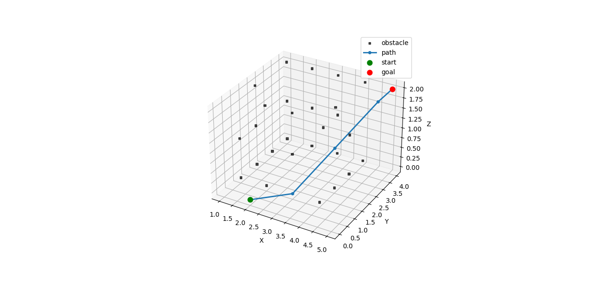
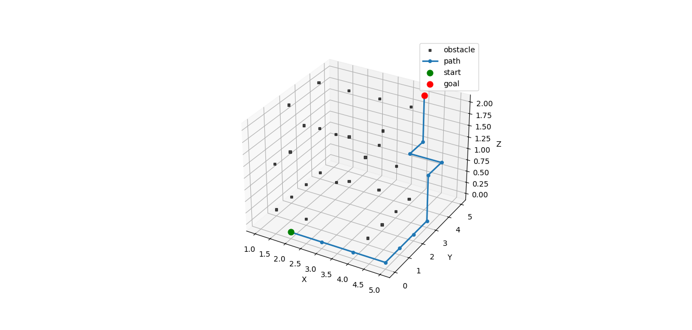

# voxnav

Voxel-based 3D A* path-planner

**Short description**

`voxnav` is a lightweight voxel-based 3D path planning project that demonstrates the A* search algorithm in three-dimensional grid environments.
The planner is implemented in modern C++ and supports both axis-aligned and diagonal moves. Example maps and test cases are included to help validate the implementation.
For visualization, a companion Python script generates 3D plots of the computed paths, making it easier to understand how the algorithm explores the voxel space and connects start and goal points.

---

## Features

* A* path planning on a 3D voxel grid
* Config-driven example maps
* Unit / integration tests runnable via `ctest`
* Python script to plot the resulting path

---

## Repository layout

```
/ (repo root)
├─ CMakeLists.txt
├─ src/                # C++ source code (planner, grid map)
├─ include/            # headers
├─ config/             # example maps and configuration files
├─ scripts/            # python plotting scripts (e.g. plot_path.py)
├─ tests/              # test cases
├─ path3d.png          # example output image
├─ out_path.csv        # example path output (CSV)
└─ README.md           
```

---

## Requirements

* CMake (>= 3.10 recommended)
* A C++ compiler that supports C++11 or later (MSVC/Visual Studio on Windows, gcc/clang on Linux/macOS)
* Python 3.8+ for the plotting script
* Python packages: `numpy`, `matplotlib` (installable via `pip`)

> Tip: Use a virtual environment for the Python plotting script.

---

## Quick start (Windows)


```powershell
mkdir build
cd build
cmake ..
cmake --build . --config Debug
ctest -C Debug --output-on-failure   # for testcase chk
.\Debug\voxnav.exe config\example_map.txt sx sy sz gx gy gz --diag
cd ..
.\.venv\scripts\python.exe scripts\plot_path.py
```

**Notes:**

* Replace `sx sy sz gx gy gz` with the start and goal coordinates (x y z) used by your map. The `--diag` flag enables diagonal moves (if supported by the planner).
* The produced output files used by the plotting script (for example `out_path.csv` and `out_occupied.csv`) are generated in the repository root by the planner executable.

---

## Quick start (Linux / macOS)

A comparable workflow on Unix-like systems (bash/zsh):

```bash
mkdir -p build && cd build
cmake ..
cmake --build . --config Debug
ctest -C Debug --output-on-failure
./voxnav config/example_map.txt sx sy sz gx gy gz --diag
# activate your python venv e.g. source .venv/bin/activate
python3 scripts/plot_path.py
```
---

## Configuration / example maps

* Example configuration and map files are provided under `config/`. Use `config/example_map.txt` as a starting point when running the planner.

---

## Running tests

From the `build` directory run:

```bash
ctest -C Debug --output-on-failure
```

This will execute the test suite in `tests/` and print any failing test output.

---

## Plotting / visualization

After running the planner, call the Python plotting script to visualise the path. The script expects the planner output files (CSV) to be present in the repository root. Example (Windows):

```powershell
.\.venv\scripts\python.exe scripts\plot_path.py
```

---

## Example images

**With diagonal moves enabled**

  
*Path from `(2,0,0)` to `(5,4,2)` with `--diag` enabled.*

**Without diagonal moves**

  
*Path from `(2,0,0)` to `(5,4,2)` without `--diag`.*

---

## Contact

Email : dastgir7999@gmail.com

---

